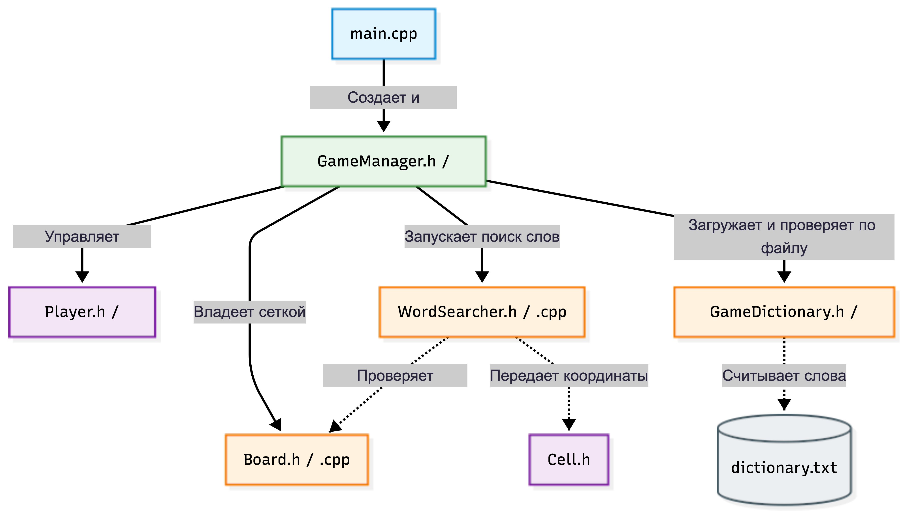
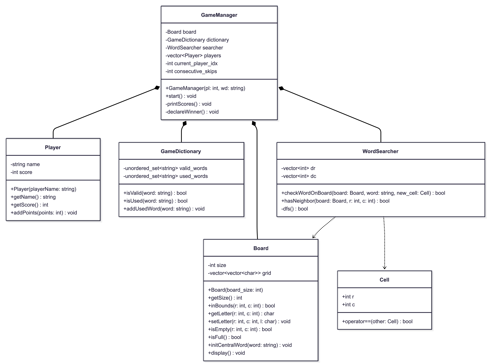
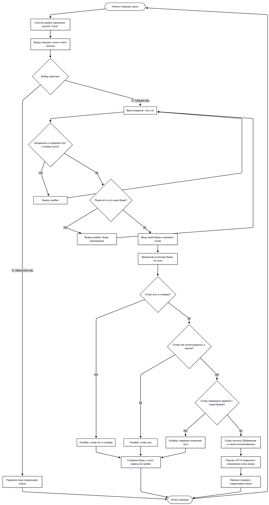

# Консольная игра «Балда» 

## 1. Введение и назначение программы
Данная программа представляет собой компьютерную реализацию классической лингвистической настольной игры «Балда». Программа предназначена для обеспечения игрового процесса в режиме одного экрана (Hotseat) для компании от 2 до 4 человек. 

Основная цель игры — поочередно добавляя по одной букве на игровое поле размером 5x5, составлять новые существительные и набирать очки, равные количеству букв в составленном слове.
## 1.2 Структурная схема модулей проекта и их взаимосвязей

---

## 2. Объектная модель классов (Архитектура ПО)
 каждый класс представляет собой независимую сущность с инкапсулированными свойствами (переменными) и поведением (методами).

### Подробная спецификация компонентов ПО:

### 1. Player (Сущность игрока)
* **Приватные свойства (`private`):**
  * `std::string name` — текстовое имя игрока (например, "Игрок 1").
  * `int score` — текущее количество набранных игроком очков.
* **Публичные методы (`public`):**
  * `Player(const std::string& player_name)` — конструктор для инициализации карточки игрока.
  * `getName() const` — безопасный геттер для чтения имени.
  * `getScore() const` — безопасный геттер для чтения текущего счёта.
  * `addPoints(int points)` — метод для начисления заработанных за ход очков.

---

### 2. GameBoard (Игровое поле)
* **Приватные свойства (`private`):**
  * `char board[5][5]` — статическая двумерная матрица символов, полностью скрытая от прямого изменения извне.
* **Публичные методы (`public`):**
  * `GameBoard()` — конструктор, очищающий поле пробелами при старте.
  * `initCentralWord(const std::string& word)` — размещение стартового слова в центральной строке поля.
  * `display() const` — отрисовка сетки поля и текущих букв в консоли.
  * `setLetter(int row, int col, char letter)` — установка символа в выбранную ячейку.
  * `getLetter(int row, int col) const` — получение символа из конкретной ячейки.
  * `isEmpty(int row, int col) const` — проверка, пуста ли выбранная клетка.
  * `hasNeighbors(int row, int col) const` — проверка того, что новая буква соприкасается по граням с уже существующими буквами на поле.

---

### 3. GameDictionary (Словарь игры)
* **Приватные свойства (`private`):**
  * `std::set<std::string> valid_words` — база данных всех разрешенных слов, загруженная из файла `dictionary.txt`.
  * `std::set<std::string> used_words` — список слов, которые игроки уже составили в текущей сессии.
* **Публичные методы (`public`):**
  * `GameDictionary(const std::string& filename)` — конструктор, который парсит файл словаря и очищает строки от невидимых системных символов Windows (`\r`).
  * `isValid(const std::string& word) const` — проверка, существует ли придуманное слово в официальном словаре.
  * `isUsed(const std::string& word) const` — проверка, не называл ли кто-то это слово ранее в этой партии.
  * `addUsedWord(const std::string& word)` — занесение слова в список использованных (блокировка его для последующих ходов).

---

### 4. WordSearcher (Логический валидатор пути)
* **Приватные методы (`private`):**
  * `dfs(...)` — внутренний рекурсивный алгоритм поиска в глубину с механизмом отката (Backtracking). Проверяет цепочку по матрице посещений `visited`.
* **Публичные методы (`public`):**
  * `canFormWord(const GameBoard& board, const std::string& word, int target_r, int target_c)` — внешний интерфейс, запускающий сканирование поля «змейкой» для проверки введённого слова.

---

### 5. GameManager (Главный контроллер)
* **Приватные свойства (`private`):**
  * `GameBoard board` — объект игрового поля.
  * `GameDictionary dictionary` — объект словаря.
  * `WordSearcher searcher` — объект поисковика путей.
  * `std::vector<Player> players` — динамический список (вектор) объектов участников.
  * `int current_player_index` — индекс игрока, чей ход сейчас активен.
* **Публичные методы (`public`):**
  * `GameManager(int players_count, const std::string& start_word, const std::string& dict_filename)` — конструктор, настраивающий компоненты игры и создающий участников.
  * `start()` — запускает и поддерживает бесконечный игровой цикл ходов, обрабатывает команды, переключает очередь и управляет очисткой экрана.

---

## 3. Алгоритмическая блок-схема (Логика хода)

Ниже представлена блок-схема, описывающая алгоритм обработки одного хода игрока в методе `GameManager::start()`.

---

## 4. Описание ключевого алгоритма: Поиск в глубину (DFS)

Для проверки геометрической связности слова используется модифицированный алгоритм **DFS (Depth-First Search)** с возвратом (backtracking).

1. **Точка старта:** Алгоритм ищет на поле клетку, в которой стоит символ, совпадающий с первой буквой введенного слова.
2. **Рекурсивный обход:** Из этой точки функция `dfs()` пытается сделать шаг в 4 направлениях: вверх, вниз, влево, вправо.
3. **Критерии отсечения (База рекурсии):** Шаг считается ложным, если координаты вышли за пределы матрицы 5x5, если буква в ячейке не совпадает с текущей буквой слова или если клетка уже была посещена.
4. **Валидация новой буквы:** Важнейшее условие игры — слово должно включать новую букву, поставленную в этом раунде. Алгоритм проверяет, наступил ли рекурсивный путь на координату новой буквы.
5. **Откат (Backtracking):** Если путь зашел в тупик, алгоритм снимает метку "посещено" с текущей клетки и пробует альтернативную ветку движения.

---

## 5. Техническая документация

### 5.1. Руководство программиста (Развертывание и компиляция)
* **Среда разработки:** Проект адаптирован под IDE Visual Studio (2019/2022) или CLion в ОС Windows.
* **Стандарт языка:** C++11 / C++17 / C++20.
* **Зависимости:** Проект использует исключительно стандартную библиотеку шаблонов (STL) и стандартные системные вызовы Windows API (через `<windows.h>`).
* **Файловая структура:** В корневой папке скомпилированного бинарного файла (`.exe`) обязательно должен находиться файл `dictionary.txt`, содержащий базу существительных (одно слово на строку, в кодировке ANSI/Windows-1251 или UTF-8 без BOM).

### 5.2. Руководство пользователя (Правила взаимодействия)
1. **Запуск:** Запустите исполняемый файл. Консоль автоматически настроит русский шрифт.
2. **Инициализация:** 
   * Введите количество игроков (цифра от 2 до 4) и нажмите `Enter`.
   * Введите стартовое слово строго из 5 букв (например: *БАЛДА*, *ФИНАЛ*) и нажмите `Enter`.
3. **Игровой процесс:**
   * В начале хода программа выводит актуальную таблицу. Пустые клетки обозначены пробелами.
   * Нажмите `1`, чтобы сделать ход, или `0`, чтобы пропустить.
   * При выборе хода введите через пробел номер строки и столбца (например: `1 2`), куда хотите поставить новую букву.
   * Введите саму букву (в верхнем регистре) и нажмите `Enter`.
   * Программа спросит: *"Какое слово собираете?"*. Введите слово целиком.
4. **Результат:** Если слово составлено по правилам и есть в словаре, вам начислятся очки, экран очистится, и управление перейдет следующему игроку. В случае ошибки игра выдаст диагностическое сообщение и попросит ход переиграть.